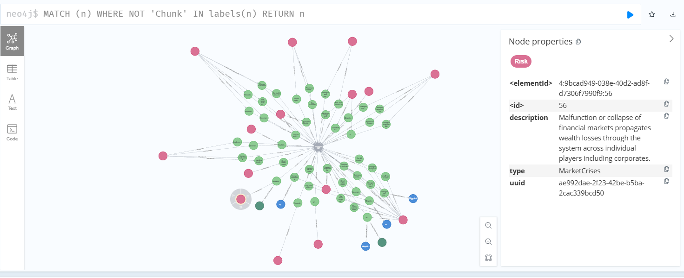
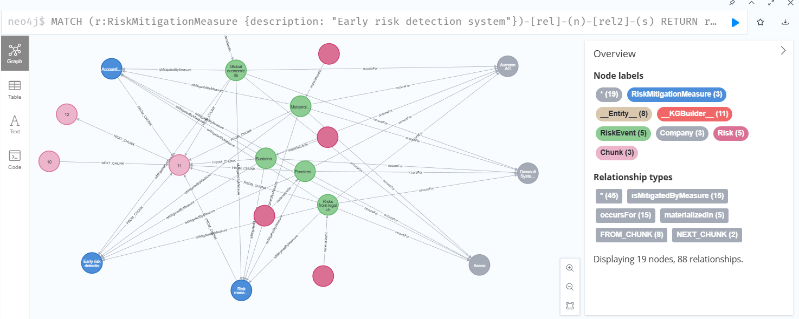

# Extracting informations from text with LLM models and ontologies



Whenever I tried naive GraphRAG solutions - those where I had to rely on LLM to extract meaningful data from unstructured data (texts), I got disappointing results:
- they tend to extract too much
- vocabulary is not consisting
- a lot of redundancy
- LLM don't understand my exact use case (view on situation), even if I provided detailed description.

With this demo, I want to demonstrate that LLM are able to deliver better results when they extract information based on a structured, explicit model of your use case and view on situation - an ontology.

## Scenario

In this demo, I construct the following scenario. Each organization works with some kinds of risks and has to establish its own risk management framework. Risks can be of different nature - economic, financial, ecological etc., have different degree of an impact, can be mitigated with different kinds of measures.

An analyst analyzing information about public companies can learn a lot about strategic and operational risks to a company from its financial reports. A structured information extraction approach, powered by LLM models and grounded via ontologies, can quickly provide structure representation of such information.


## Directory structure

- `content/`: visual materials (images and videos) related to the demo;
- `cypher/`: some useful Cypher queries that I used througout the demo;
- `semantics/`: all artifacts related to ontologies used in this demo;
- `sparql/`: some useful SparQL queries that I used througout the demo;
- `src/`: programming code that is using LLM models and ontologies to extrac information from texts.

## Used technologies

Throughout this demo I work with RDF-based ontologies (to be more explicit: RDF, RDFS and OWL) in Turtle serialization.

I used the Neo4j database as a storage solution for my knowledge graph. Many functons discussed here are based on Neo4j-specific features, such as the Cypher query language, Neo4j's GraphRAG library for Python, or the `graph-data-science` library for the database.

## Flow

In this demo I am using the GraphRAG library from Neo4j which is constructing knowledge graphs on Neo4j from unstructured data (texts). However, when I used it "naively", the results were not impressive, as I wrote above.

Thus I am feeding an ontology that is defined under `001_information-extraction\semantics\bizrisk.ttl` to it, so that it knows, what terms to use and how exactly to build up my knowledge graph. The BIZRISK ontology used here was developed by me, but I used some existing ontologies as foundation for mine (more details can be found in the ontology file).

The file `001_information-extraction\src\kg_construction_graphrag.py` is constructing the KG. The file `001_information-extraction\src\kg_post_processing.py` is doing some post-processing: e.g. introducing new data types or improving the quality of existing data. For example, it is mapping specific RiskEvents (such as "flood") to a taxonomy (classification) of risks, and introducing new data points, such as Risk ("ecological"), and a relationship ("materializedIn) from the Risk to the RiskEvent.

## References

The file `001_information-extraction\src\kg_construction_graphrag.py` is based on the work done by Jesus Barrasa, who at the time of the creation of this demo worked at Neo4j. He presented his solution which is feeding LLM models with ontology via Neo4j's GraphRAG library in the podcast called "Going Meta". His code can be found here ([link](https://github.com/jbarrasa/goingmeta/tree/main)), specifically under session 31.

----------------------------------------

# Ontology design

This section will go into technical details regarding my ontology.

## Some choices

Why specify both `rdfs:Class` and `owl:Class` when defining new classes?
- `owl:Class` signals you expect OWL reasoning capabilities (e.g., consistency checking, complex inferences).
- `rdfs:Class` signals basic RDF Schema class typing.
--> to support a broad range of clients.

Why I used skos:Concept and OWL:Class at the same time when defining my risk taxonomy? Experiment: try to have best of both worlds: formal reasoning capabilities from OWL and vocabulary management from SKOS.

Why I used DOLCE as foundational ontology for the `Risk` classes, although I really like BFO?
DOLCE rigorously treats mental objects as:
- Non-physical and non-social, in that they have no independent physical location or existence outside an agent’s mind.
- Specific to a single intentional agent: The same mental object cannot simultaneously depend on multiple agents.
- Fundamental to representing cognitive states, attitudes, and internal representations such as beliefs, desires, intentions, and percepts.

Compared to it, BFO is all about science. Not good to model abstract things.
- Instead, DOLCE offered the concept of mental object: mental objects are classified as a subtype of non-physical objects that are specifically dependent on an intentional agent (such as a person or other agent capable of having mental states).These are distinct from social or physical objects and are considered “private” experiences or entities, in contrast to objects that exist independently in the external world

I aggregated risks on the family level, as I wanted to keep the knowledge base concise. I didn't go deeper, as the Cambridge Taxonomy of Business Risks would allow.

## Some ideas for improving the ontology:

- Add `:RiskTreatmentMethod`. Distinguish between risk response and treatment / preparation strategy? Can be both at the same time.
- Add `:RiskEventCause`


## Other ontologies and taxonomies for modeling business activities and risks

Great taxonomy of economic activities: https://www.openriskmanual.org/wiki/NACE_2.1_Classification

Multiple ontologies and taxonomies for AI risks are described here: `003_security-and-audit\ontologies-for-ai.md`

-----------------------------------------------

# Data extraction process

3 options for architecture:
1. load ontology + write SHACL to control (in neosemantics, you can see what violated the shapes)
2. serialize not in Cypher, but in RDF, or even better: JSON + pydantic validator (and LLM that supports output in certain format)
3. GraphRAG with schema (derived from ontology), entity resolution and Q&A (cypher construction based on onto)
--> I picked the third option.

3 options for processing of large documents:
1. Process pdf in chunks of 5 / 10 pages with GraphRAG. Problems: 1) disambuigation / deduplication? 2) The numeration of chunks in the graph - is there a way to keep the sequential numeration, or will it try to start with 1 every time?
2. Load lexical graph -> do RAG / similarity search based on specific ontology -> choose chunks that are relevant for the domain graph -> build the domain graph based on those chunks. That would be better for building a true metadata knowledge graph, and to allow enrichment of the KG with different views (expressed as ontologies), but I didn't need it for my personal, simple use case.
3. Do similarity search locally -> pick only relevant pieces of the document -> construct KG.
--> I picked the third option.

How to improve:
- Pre-processing: agentic checks
- Post-processing: N10s has a Cypher endpoint, which can convert results of Cypher query to RDF -> if you want to prepare data for semantic web tools
- Post-processing: SHACL
- Flow: make a proper pipeline. E.g. with [bauplan](https://docs.bauplanlabs.com/en/latest/concepts/pipelines.html) (features: versioned pipelines runs, DAG construction, reading data from file storage, functions runnable on serverless platforms, tests for data pipelines)
- Multithreaded similarity analysis

Advices on how to design the process:
- use many small, focused ontologies to keep models concentrated on your task
- when extracting data from text: work with chunks of small size, with little overlaps

-----------------------------------------------

# Data analytics in the knowledge graph

A knowledge graph would not be complete without analytics run over it. I used Neo4j's graph-data-science library to run some simple analytics cases on my KG.

## Research questions

KG that I built for this demo was small and container at max. data about 3 public companies. So I could visually inspect my graph and identify its properties. But I was curious: if I try to describe my graph mathematically (using graph algorithms), how precise will that description be?

My KG consisted of operational data for 3 public companies. So the KG had 3 nodes of the type "Company", with many incoming connections from the nodes with label "RiskEvent". Each RiskEvent was mapped to a Risk from a risk classification (taxonomy) during the post-processing. Each Risk node may to have relationships to multiple RiskEvents. Each RiskEvent can have relationships to multiple Companies.

Below you can find the queries which applied graph algorithms to my KG, and the results that were returned.

I want to try out some more advanced use cases in the future. For example:
1) find similar Risk events: [link](https://neo4j.com/docs/graph-data-science/current/getting-started/fastrp-knn-example/);
2) load older reports for the same companies, and check how importance of risk changed over time;
3) try to to train predictive supervised models to solve graph problems, such as predicting missing relationships --> could be interesting in the context of strategy planning using framework like Wardley Maps (see below for more details).

## Graph algorithms

Graph algorithms provide insights on relevant entities in the graph (centralities, ranking), or inherent structures like communities (community-detection, graph-partitioning, clustering). They might traverse the graph (using breadth-first or depth-first searches, pattern matching or random walks). Optimized algorithms are able to remember already explored parts and parallelize operations.

Algorithm traits:
- directed vs. undirected
- Heterogeneous (able to distinguish between diff. types of nodes and relationships)
- Weighted relationships (supports configuration to set relationship properties to use as weights).

Execution mode: stream, mutate or write.

## Implementation

### Preparation steps
At first, graph has to be projected (which in Neo4j means: copied and modified into some optimized form which allows analytics with `graph-data-science`)

Project the whole graph:
```
CALL db.labels() YIELD label
WITH collect(label) AS allLabels
CALL gds.graph.project(
  'bizriskGraph',
  allLabels,
  ['hasImpactOnOperations', 'isMitigatedByMeasure', 'hasSeverity', 'materializedIn', 'occursFor']
)
YIELD graphName, nodeProjection, nodeCount AS nodes, relationshipCount AS rels
RETURN *
```

Before we run actualy queries, we can estimate the memory usage for different algorithms:
```
// for the 1st algorithm
CALL gds.graph.louvain.stream.estimate('bizriskGraph')
YIELD nodeId, communityId, intermediateCommunityIds
RETURN gds.util.asNode(nodeId) AS nodeID, communityId

// for the 1st algorithm
CALL gds.betweenness.write.estimate('bizriskGraph', { writeProperty: 'community' })
YIELD nodeCount, relationshipCount, bytesMin, bytesMax, requiredMemory, treeView, mapView,heapPercentageMax
```

### Results for different algorithms
Some of the algorithm types that were of interest for me:
| **Algorithm group**    | **Algorithms**    | **Purpose** |
| -------- | ------- | -------- |
| Centrality  | Page Rank, Betweenness Centrality, Degree centrality  | To determine the importance of distinct nodes in a network. Used for: Recommendations, supply chain analytics, project analytics |
| Community Detection |   Louvain Community Detection,  Weakly Connected Components (WCC)  |  evaluate how groups of nodes may be clustered or partitioned in the graph |


**Degree centrality** is one of the most ubiquitous and simple centrality algorithms. It counts the number of relationships a node has. In the GDS implementation, we specifically calculate out-degree centrality which is the count of outgoing relationships from a node.

```cypher
CALL gds.degree.stream('bizriskGraph')
YIELD nodeId, score
RETURN
  gds.util.asNode(nodeId) AS nodeID,
  score AS mostMaterializationsHappened
ORDER BY mostMaterializationsHappened DESCENDING, nodeID LIMIT 3
```
--> result: 5 Risk nodes. 

If we revert the relationships:
```cypher
CALL gds.degree.stream(
    'bizriskGraph',
    { orientation: 'REVERSE' }
    )
YIELD nodeId, score
RETURN
gds.util.asNode(nodeId) AS nodeID,
score AS mostRiskEventsrealized
ORDER BY mostRiskEventsrealized DESCENDING, nodeID LIMIT 3
```

--------------

**PageRank**:  The underlying assumption is that more important nodes are likely to have proportionately more incoming relationships from other important nodes. 
```cypher
CALL gds.pageRank.stream('bizriskGraph')
YIELD nodeId, score
RETURN
  gds.util.asNode(nodeId) AS nodeID,
  score AS influence
ORDER BY influence DESCENDING, nodeID LIMIT 5
```
--> returned, no surprise, the 3 companies, but also one of the RiskMitigationMeasure nodes (with description: "Early risk detection system"). I checked this node, and it turned to be connected to all 3 companies:


--------------

**Betweenness Centrality**: Measures the extent to which a node stands between the other nodes in a graph. It is often used to find nodes that serve as a bridge from one part of a graph to another.
```cypher
CALL gds.betweenness.stream('bizriskGraph')
YIELD nodeId, score
RETURN gds.util.asNode(nodeId) AS nodeID, score
LIMIT 10
```
--> as I expected, it returned multiple Risks, but not only.

--------------

**Louvain** maximizes a modularity score for each community, where the modularity quantifies the quality of an assignment of nodes to communities. This means evaluating how much more densely connected the nodes within a community are, compared to how connected they would be in a random network. Louvain optimizes this modularity with a hierarchical clustering approach that recursively merges communities together.

An additional important consideration is that Louvain is a stochastic algorithm. As such, the community assignments may change a bit when re-run. If consistency is important for your use case, other community detection algorithms, such as Weakly Connected Components (WCC), take a more deterministic partitioning approach to assigning communities and thus will not change between runs.
```cypher
CALL gds.louvain.stream('bizriskGraph')
YIELD nodeId, communityId, intermediateCommunityIds
RETURN gds.util.asNode(nodeId) AS nodeID, communityId
```
--> returned 85 communities, which can be studied as follows.

Write the communityId as property back into the projected (virtualized) graph using `mutate` method:
```cypher
CALL gds.louvain.mutate('bizriskGraph', { mutateProperty: 'communityId' })
YIELD communityCount, modularity, modularities

// Query the projected graph for top 5 communityId values by frequency
CALL gds.graph.nodeProperty.stream('bizriskGraph', 'communityId')
YIELD nodeId, propertyValue
RETURN propertyValue AS communityId, count(*) AS nodeCount
ORDER BY nodeCount DESC, communityId
LIMIT 5

// Query nodes from specific communities in the projected graph
CALL gds.graph.nodeProperty.stream('bizriskGraph', 'communityId')
YIELD nodeId, propertyValue
WITH nodeId, propertyValue AS communityId, gds.util.asNode(nodeId) AS node
WHERE communityId IN [294, 229]
RETURN node, communityId, labels(node) AS nodeLabels
ORDER BY communityId, nodeLabels
```

-----------------------------------------------


# Future development

Some ideas for the future
- check alternatives to GraphRAG --> think of solution for generating libraries of knowledge. E.g. strategy patterns. Formulate inductive patterns for ontology construction and maintenance.
    - https://github.com/AuvaLab/itext2kg
    - https://github.com/LMMApplication/RAKG
    - LangExtract (Python)
- apply reasoners for deriving new data based on the following: subclass relationships, domain/range constraints, `owl:sameAs`, `owl:inverseOf`, disjoint classes, transitive properties, SWRL rules. Description logic inference: owl:intersectionOf, owl:unionOf, owl:someValuesFrom ——> use Apache Jena to infer new data before loading to Neo4j.  
    - If you want to work with RDF triple and not Neo4j, then you don't necessarily need inference. Instead, you could put a lot of the (business) logic into the query rather than into the data model. SPARQL makes it possible to establish a context of operation in ways that inferencing does not. + use SHACL for validation.
- submit a data model for risk management to Neo4j [docs site](https://neo4j.com/developer/industry-use-cases/data-models/transactions/transactions-base-model/)?


## Connection to Wardley maps

Goal: create situational awareness.

Connect existing KG to the Wardley maps:

1. taxonomy of patterns -> create a lib -> link risks or financial situation to possible choices?
    - https://learnwardleymapping.com/leadership/
    - https://learnwardleymapping.com/climate/
    - cooperate, collaborate, conflict + border
    - constraint, strategic investment
2. Populate the wardley map of a company based on annual report
    - identify future / current stage of evolution
    - inertia
    - planned or possible actions e.g. strategic investment
    - chances and risks
    - business thermomap the products of company


