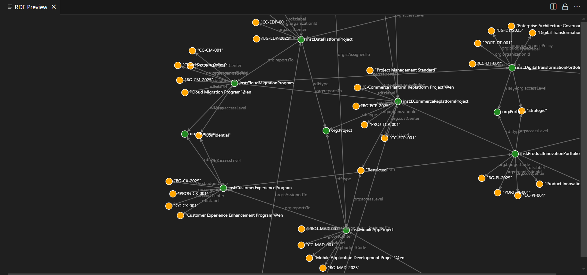

# How ontologies can help creating semantic master data and managing assets?

🕸 This is the showcase for how ontologies can help with:
1. **data interoperability**. Interoperable data is one that can be understood ans used by different parties.This requires some sort of a controlled vocublary, or semantic master data.
2. **asset management**. Given that you have a controlled vocabulary, you can use it annotate data or tag assets - servers, databases and cloud resources - in a unified way.

Both problems are related, and asset management is just one of the use case that gets unlocked when you have semantic master data, be it taxonomies - hierarchical set of concepts; ontologies - full metamodel built on top of taxonomies which says what is possible in your worldview and what is not; or just a controlled vocabulary or thesaurus.

⚠️ **Note: the code used here was not used under real circumstances, but only serve demonstration purposes.**
- RDF data was visualized and loaded into a graph storage, and SPARQL queries were executed in order to validate that they work in general; however, I cannot exclude bugs, redundancies or any other poor design decisions.
- The AWS policies and cloudquery queries were not tested.




## Problem statements

Imagine that you have a model for your organisational structure, with all the portfolios, projects, products and so one. All those organisational entities have their own governance and reporting policies.

Most organisational units nowadays would use some sort of digital tools, like e.g. AWS cloud, Jira, Github and so on. Each of those services has its own vocabulary of units of different level of granularity: AWS has "organisations" and "accounts", Jira has "projects" and "boards", Github has "organisations" and "repositories".

***If you or your automation software aka "AI agents" would get a request to find out the costs of digital tools of each of our "projects", how would you interpret this?*** (I am not sure if the request in this form makes a lot sense, but I wanted to pick an understandable metaphor)

Maybe you use some kind of tool - like e.g. [cloudquery](https://github.com/cloudquery/cloudquery) - to pull data from different services into one database or data warehouse. You would look into the table and find all those "accounts", "organisations" and "projects". What is what? And what is what you need?

## Ontology as foundation

You can define all those organisational units and their governance models in your ontology:

`./semantics/organizational-ontology.ttl`:

```
# Root organizational entity
org:Organization a owl:Class ;
    rdfs:label "Organization"@en ;
    rdfs:comment "The root entity representing the entire enterprise or company"@en ;
    skos:definition "A legal entity or enterprise that contains all other organizational units"@en .

# Strategic level - Portfolio management
org:Portfolio a owl:Class ;
    rdfs:label "Portfolio"@en ;
    rdfs:comment "A collection of programs and projects managed together to achieve strategic objectives"@en ;
    skos:definition "Strategic grouping of initiatives aligned with business strategy and investment priorities"@en ;
    rdfs:subClassOf org:OrganizationalUnit .

org:Program a owl:Class ;
    rdfs:label "Program"@en ;
    rdfs:comment "A group of related projects managed together to obtain benefits not available from managing them individually"@en ;
    skos:definition "Temporary organizational structure to coordinate multiple related projects"@en ;
    rdfs:subClassOf org:OrganizationalUnit .

# and so one
```

If you define what is a Project or a Program once, and then connect specific licenses or units of digital services to those definitions, you can find out what account is managed by a project, and what - by a program, and how all of them are related to each other.

## Usage of ontologies

You could either connect your data directly to your ontology:

`.semantics/organizational-instances.ttl`:

```
inst:TechCorpEnterprise a org:Organization ;
    rdfs:label "TechCorp Enterprise"@en ;
    org:organizationId "TECHCORP-001" ;
    rdfs:comment "Main enterprise organization"@en .

# Strategic Level - Portfolios
inst:DigitalTransformationPortfolio a org:Portfolio ;
    rdfs:label "Digital Transformation Portfolio"@en ;
    org:organizationId "PORT-DT-001" ;
    org:budgetCode "BG-DT-2025" ;
    org:costCenter "CC-DT-001" ;
    org:accessLevel "Strategic" ;
    org:governancePolicy "Enterprise Architecture Governance" ;
    org:belongsToOrganization inst:TechCorpEnterprise .

...

inst:SecurityAWSAccount a org:CloudServiceScope ;
    rdfs:label "Security Services AWS Account"@en ;
    org:scopeIdentifier "123456789015" ;
    org:scopeType "AWS-Account" ;
    org:scopeUrl <https://123456789015.signin.aws.amazon.com/console> ;
    org:isAssignedTo inst:SecurityTeam ;
    org:isProvidedBy inst:AWSServiceProvider .

```

Or you could tag your cloud resources with the concepts from the ontology:

`./prompt-aws-tagging-strategy.md`:

```json
{
  "Version": "2012-10-17",
  "Statement": [
    {
      "Sid": "RequireOrganizationalTags",
      "Effect": "Deny",
      "Action": [
        "ec2:RunInstances",
        "rds:CreateDBInstance",
        "s3:CreateBucket"
      ],
      "Resource": "*",
      "Condition": {
        "ForAnyValue:StringNotLike": {
          "aws:RequestTag/OrganizationId": [
            "PROJ-*",
            "PROD-*",
            "DEPT-*",
            "TEAM-*",
            "OPS-*"
          ]
        }
      }
    }
  ]
}
```

Or create an AWS Config rule that would check your resources.

And then query your cloudquery tables on tags which use the concepts from your ontology (check `./prompt-cloudquery-configurations.md` for more information)

## How far can it go?

*(summary of an exciting case study)*

As Netflix showed in their post about a [Unified Data Architecture](https://netflixtechblog.com/uda-unified-data-architecture-6a6aee261d8d) - pretty far.

What did they do?

**Domain model**:
- They created an official vocabulary an RDF
- They used named graphs for that, as they are versionable and queryable
- They added mappings to specific data containers like a Data product in data mesh, an Iceberg table etc.
- and schema definition languages (like GraphQL, Avro, SQL, RDF, and Java) that the domain model can transpile to.

They called their domain modeling language, based on RDF, "upper". And here are some examples from their "upper" ontology: ```upper:Domain, upper:DomainModel, upper:DirectClass, upper:Attribute, upper:Relationship, upper:datatype, upper:description, upper:label```.

**Transpilation and movement of data**:
- the define what is "datamesh", "avro" and other data containers. in their ontology. Of course, in the context of their company. E.g. ```datamesh:Source, datamesh:Type (e.g. "APPLICATION_PRODUCER"), datamesh:schema```.
- They define a mapping from ontology of concepts to specific data containers.

Thanks to that, their Unified Data Architecture platform can automatically create schemas for their RDF data, and sometimes, also populate specific data containers.

**Discovery**

UDA allows for querying the knowledge graph and searching for the concepts and data that instantiates them.