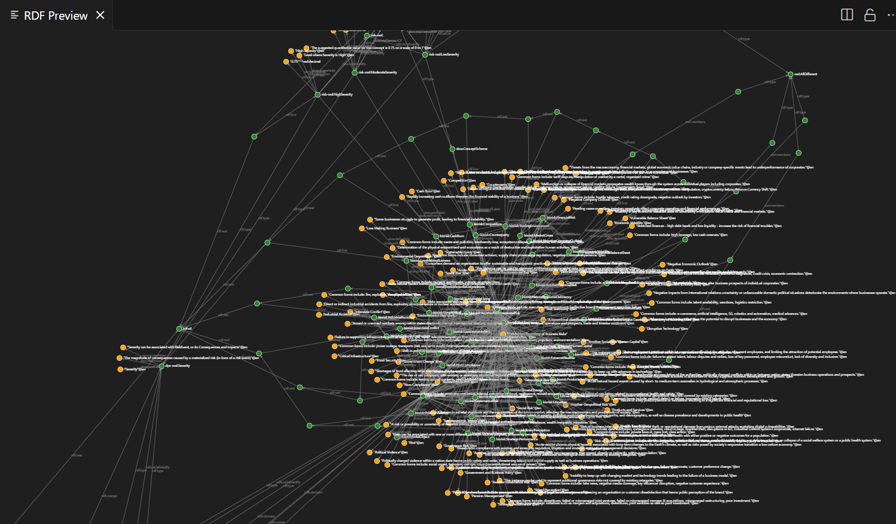
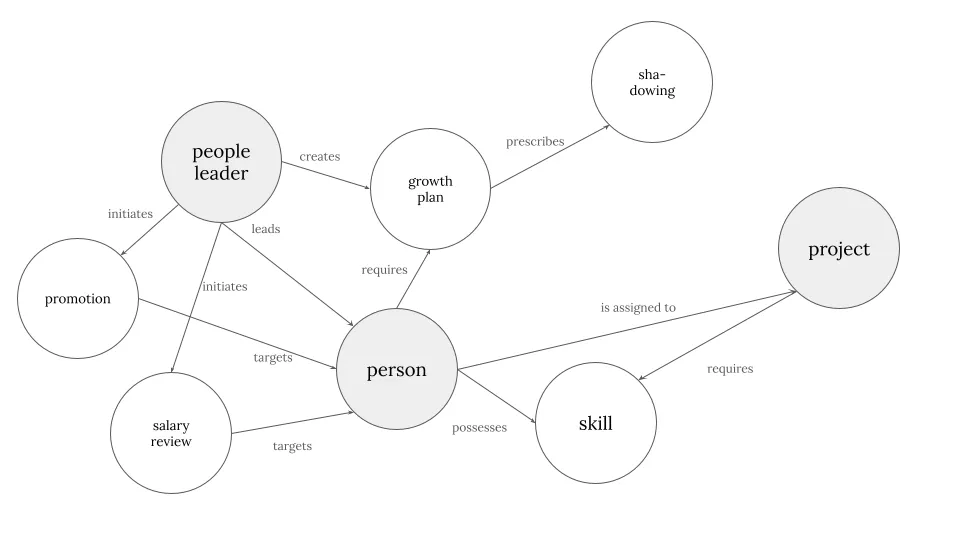

# Using ontologies in business strategy and operations

## Context and motivation

This repository was created when everybody was thinking how to use AI in their organisations. The problem with AI models - especially with large language models (LLM) - is that they "hallucinate" as they lack true understanding of our world. So if you want that AI plays on your rules, you have to ground your world view a model. Keyword: business modeling, model-based systems engineering, enterprise architecture.

Luckily, specialists have been developing technologies and practices for modeling for decades. But materials about ontologies - way to express knowledge as an explicit, structured model - are often pretty hard to understand even for technical people. Thus I got the idea of developing a number of practice-oriented demos.

This repository presents multiple real-world scenarios for developing a knowledge base which can be used to enhance AI capabilities.

## What are ontologies

*Visualization of an ontology with RDF Preview (Visual Stuido Code)*

📖 If your are new to ontologies, you can read my article: "Teaching AI to understand our world: explaining ontologies like you’re 5 years old" ([link](https://medium.com/ai-advances/teaching-ai-understand-our-world-explaining-ontologies-like-you-are-5-years-old-4e5653b5fcb1)), where I try to explain them as simple as possible, with some visuals. You can also check out another piece of me, "A Complaint from AI: 'I don\'t Understand Your Company'" ([link](https://medium.com/analysts-corner/a-complaint-from-ai-i-dont-understand-your-company-8314e39a2072)), where I explain the value of ontologies through the business lens.

## Viewing the world as a graph

A graph consists of nodes and relationships between them. Anything can be modeled as a graph. If you think about it, you see graphs everywhere, be it process diagrams or your navigator.

_An exemplar graph illustrating some of the duties of a people leadership role in a consulting company (speaking from my experience)_

## Structure of the repository

| Folder      | Scenario |  Technologies used | Status |
| ----------- | ----------- | ------------- | ------------- |
| `001_information-extraction/` | Extract high-quality information from text and construct a knowledge graph | Python, Neo4j, GraphRAG, ontologies (Turtle, OWL), embeddings & semantic search | ✅ implemented as a ready solution |
| `002_master-data-and-asset-management/` | Define business concepts once - use them everywhere | Ontologies (Turtle, OWL), Python, AWS | ✅ implemented as text guide |
| `003_security-and-audit/` | Use ontology as single souce of truth for IT security framework | Ontologies (Turtle, OWL), Python, Pydantic | ✅ implemented as text guide |
| `004_diagrams-to-process-models/` | Construct digital twins for business processes using diagrams as foundation | PlantUML, Neo4j | 🚧 in progress |
| `005_mindful-machines/` | Industrial use cases: classification of machines, providing context for telemetry data etc. | Machine learning and deep learning, Python, Schema.org | 🚧 in progress |
| `006_synthetic-world/` | Generate accurate synthetic data based on ontology | ... | 🚧 in progress |
| `007_industry-solutions/` | Solutions and ideas for specific industries | ... | 🚧 in progress |

